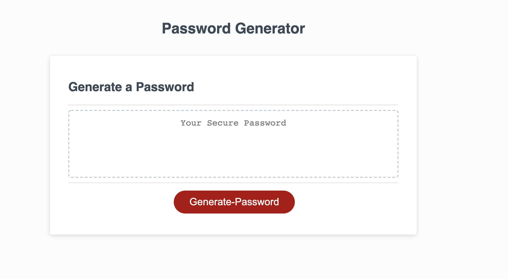
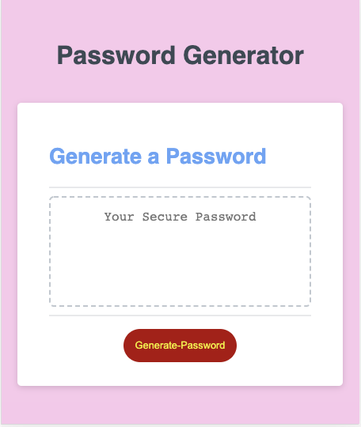

# 03 JavaScript: Password Generator

## About the project 
I created an application that an employee can use to generate a random password length of 8-128. It prompts the user to select if they would like lower, upper, number, and/or special characters in their password. The page is responsive and works on different screen sizes. I used HTMl, CSS, and JavaScript to make this application.

## Mock-Up

The following image shows the web application's appearance and functionality:

Password generator demo

 

## Review

<a href="https://github.com/erumd"> https://github.com/erumd</a>

<a href='https://erumd.github.io/Password-Generator/'> https://erumd.github.io/Password-Generator/ </a>

I used Visual Studio code to build the application. Resources I used to help with write proper functioning code are Stackoverflow, w3schools, and MDN developer mozilla. I used list of Password Special Characters from the OWASP Foundation] https://www.owasp.org/index.php/Password_special_characters. I would also like to thank my classmates for doing a study group to help each other out. I could not have done completed this assignment without them. 

- - -
© 2020 Trilogy Education Services, a 2U, Inc. brand. All Rights Reserved.
